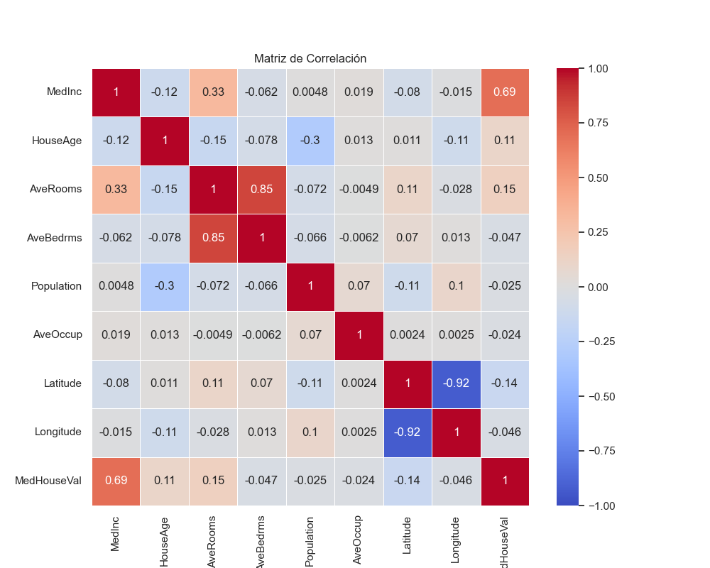
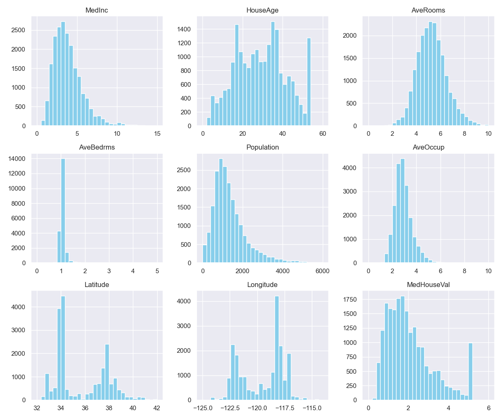
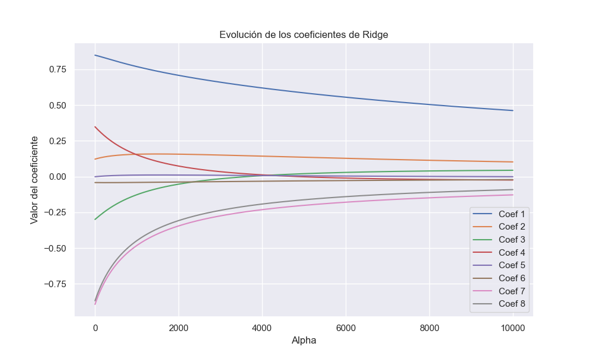
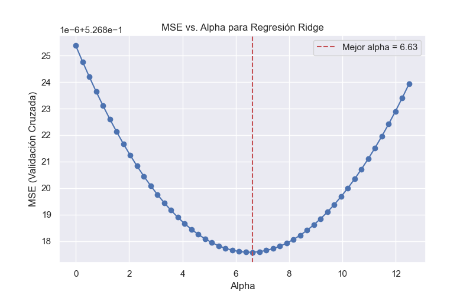

# TP2: Regresión del valor de valor medio de casas en distritos de California (20Co2025)

## Grupo de trabajo 1
**Miembros:**
- Martin Brocca <martinbrocca@gmail.com>
- Emiliano Iparraguirre <emiliano.iparraguirre22@gmail.com>
- Natalia Espector <nataliaespector@gmail.com>
- Agustin Lopez Fredes <agustin.lopezfredes@gmail.com>
- Fernando Martinez <fgmartinez1989@gmail.com>

##

Se requiere construir una regresión que permita predecir el valor medio de las casas en distritos de California, EE. UU. (medido en cientos de miles de dólares, es decir, $100,000). Este conjunto de datos proviene del censo de 1990 de EE. UU., donde cada observación corresponde a un bloque. Un bloque es la unidad geográfica más pequeña para la cual la Oficina del Censo de EE. UU. publica datos de muestra. Un bloque típicamente tiene una población de entre 600 y 3.000 personas.

Los atributos, en el orden en que se encuentran en el conjunto de datos, son:

- **MedInc**: Ingreso medio en el bloque
- **HouseAge**: Edad mediana de las casas en el bloque
- **AveRooms**: Número promedio de habitaciones por hogar.
- **AveBedrms**: Número promedio de dormitorios por hogar.
- **Population**: Población del bloque
- **AveOccup**: Número promedio de miembros por hogar.
- **Latitude**: Latitud del bloque
- **Longitude**: Longitud del bloque
  
El target es:

- **MedHouseVal**: Mediana del costo de las casas en el bloque (en unidades de $100,000).

### Tareas y preguntas a resolver:

1. Obtener la correlación entre los atributos y entre los atributos y el target. ¿Qué atributo tiene mayor correlación lineal con el target? ¿Cuáles atributos parecen estar más correlacionados entre sí? Se pueden obtener los valores de correlación o graficarlos directamente utilizando un mapa de calor.
2. Graficar los histogramas de los diferentes atributos y el target. ¿Qué tipo de forma tienen los histogramas? ¿Se observa alguna forma de campana que sugiera que los datos provienen de una distribución gaussiana, sin realizar pruebas de hipótesis?
3. Calcular la regresión lineal utilizando todos los atributos. Con el conjunto de entrenamiento, calcular la varianza total del modelo y la varianza explicada por el modelo. ¿Está el modelo capturando el comportamiento del target? Expanda su respuesta.
4. Calcular las métricas de MSE, MAE y R² para el conjunto de evaluación.
5. Crear una regresión de Ridge. Usando validación cruzada de 5 folds y tomando como métrica el MSE, calcular el mejor valor de α, buscando entre [0, 12.5]. Graficar el valor de MSE versus α.
6. Comparar entre la regresión lineal y la mejor regresión de Ridge los resultados obtenidos en el conjunto de evaluación. ¿Cuál de los dos modelos da mejores resultados (usando MSE y MAE)? Conjeturar por qué el modelo que da mejores resultados mejora. ¿Qué error se puede haber reducido?

### Entregables:

El entregable debe consistir en uno o más archivos de notebook Jupyter (.ipynb) con las respuestas. Aunque se permite usar otros tipos de entregables, es importante incluir tanto el código como las respuestas. Pueden subir el contenido o proporcionar un enlace a un repositorio público (GitHub o GitLab) con el contenido. No olviden especificar los autores del trabajo práctico en el entregable.

### Recursos:

Para resolver este trabajo práctico, son libres de utilizar los recursos que consideren necesarios. Pueden hacerlo en cualquier lenguaje de programación y de la forma que consideren apropiada.

##

## Resolución de consignas

### 1. Correlación entre atributos y con el target

Se calculó la matriz de correlación entre las variables del dataset y se visualizó mediante un mapa de calor. El atributo más correlacionado linealmente con el target `MedHouseVal` fue:

- **`MedInc` (Ingreso medio)**, con una correlación cercana a **+0.69**, lo que indica una **fuerte relación positiva**. Esto puede indicar que a medida que el ingreso promedio aumenta, también aumenta el valor de la casa. 

También se observaron correlaciones destacadas entre:

- `AveRooms` y `AveBedrms` (alta correlación positiva, >0.8). El número de habitaciones tiene una correlación con la cantidad de dormitorios.
- `Latitude` y `MedHouseVal` mostraron correlación negativa. La latitud tiene una correlación negativa con el valor de la casa.

**Heatmap de correlación**:

---

### 2. Histogramas de los atributos

Se graficaron histogramas para todas las variables predictoras y el target. Algunas distribuciones mostraron una forma levemente gaussiana (por ejemplo, `HouseAge`), mientras que otras como `Population` o `MedHouseVal` presentaron asimetría.

En resumen, el análisis visual mostró:

- `AveRooms`: distribución cercana a gaussiana, centrada alrededor de 5.
- `Population`, `AveOccup`: colas largas a la derecha.
- `MedInc`: distribución asimétrica, sesgada a la derecha.
- `Latitude`, `Longitude`: ambas variables geográficas muestran una marcada bimodalidad, representando las concentraciones urbanas típicas de California.
- `MedHouseVal`: distribución sesgada a la derecha, con una concentración de viviendas de menor valor, pero una larga cola de propiedades más caras.

**Histogramas**:

### Observaciones de los histogramas por variable

| **Variable**    | **Observaciones del histograma** |
|-----------------|----------------------------------|
| **MedInc**      | El histograma muestra que la mayoría de las casas tienen ingresos relativamente bajos, ya que la gráfica se encuentra sesgada a la izquierda. |
| **HouseAge**    | La mayoría de las casas tienen entre 20 y 40 años. |
| **AveRooms**    | El histograma muestra características típicas de una distribución gaussiana, como un pico central alrededor del cual se agrupan la mayoría de los datos y una forma unimodal. Sin embargo, existe un leve sesgo hacia la derecha, y la presencia de outliers afecta esta distribución. La mayoría de las casas tienen entre 4 y 6 habitaciones. |
| **AveBedrms**   | Tiene un comportamiento similar a AveRooms. |
| **AveOccup**    | La mayoría de las casas tienen entre 2 y 4 ocupantes, mostrando un sesgo a la derecha que sugiere que hay casas con un número mayor de ocupantes. |
| **MedHouseVal** | Este histograma muestra que la mayoría de las casas tienen un valor relativamente bajo, con fuerte concentración por debajo de 2. También hay algunos valores altos, indicando propiedades de lujo que, aunque menos comunes, influyen en la percepción general del mercado. |
| **Latitude**    | La mayoría de las casas se concentran entre 32 y 37 grados. Existen picos alrededor de 34 y 36 grados, lo que sugiere áreas urbanas con alta concentración de viviendas. |
| **Longitude**   | La mayoría de las casas se encuentran entre los -125 y -115 grados, con picos entre -120 y -118. Esto indica zonas urbanas específicas dentro de California. |
| **Population**  | La población se concentra entre 750 y 1500 habitantes. Hay un crecimiento hasta ~1000 y luego descenso. El leve sesgo a la derecha sugiere algunas áreas con población muy alta. |

---

### 3. Regresión lineal múltiple

Se entrenó un modelo de regresión lineal utilizando todas las variables predictoras. Se calcularon:

- **Varianza total del target** (`Var(y)`)
- **Varianza explicada por el modelo** (`Var(ŷ)`)

El R² ≈ 0.61 indica que el modelo explica el 61% de la variabilidad. Aún queda margen para mejorar (relaciones no lineales, interacciones, variables omitidas).

**Ejemplo de resultado**:
| Métrica | Valor  |
|--------|---------|
| R²     | 0.61    |
| Var(y) | 19355.93|
| Var(ŷ) | 11794.46|

Al no ser posible graficar la recta de regresión vs los datos en un gráfico 2D al tener 8 variables, graficamos los datos reales vs la predicción. A medida que los puntos se alejan de la recta diagonal implica que el error es mayor (si están por encima de la recta, el modelo está sobreestimando el valor real y viceversa)

**Real vs. predicho Linear**:

Observamos que el modelo tiende a sobreestimar los valores bajos (por ej para valor real 1 hay mayor cantidad de puntos por encima de la recta que por debajo), y a subestimar los valores los valores más elevados (por ej  en 4). Por otro lado para el valor de 5, hay una enorme dispersión, indicando una gran cantidad de puntos que el modelo subestima y también que sobreestima, por lo que no logra captar correctamente el comportamiento en esta zona.

---

### 4. Evaluación del modelo lineal

Para evaluar el rendimiento del modelo de regresión lineal, se calcularon las siguientes métricas sobre el conjunto de test:

- **MAE**: error absoluto medio
- **MSE**: error cuadrático medio
- **R²**: coeficiente de determinación (qué tan bien se explica la varianza del target)

Además, se compararon los resultados con un modelo base (`baseline`) que simplemente predice la media del conjunto de entrenamiento como constante para todos los casos.

**Resultados del modelo lineal (test set):**

| Métrica | Valor  |
|---------|--------|
| MAE     | 0.527  |
| MSE     | 0.531  |
| R²      | 0.596  |
| AbsErr% | 31.75% |

**Resultados del baseline (predicción constante):**

| Métrica | Valor  |
|---------|--------|
| MAE     | 0.906  |
| MSE     | 1.313  |
| R²      | -0.00  |
| AbsErr% | 62.29% |

**Conclusión**:  
El modelo lineal supera ampliamente al baseline, logrando una reducción del error absoluto medio (MAE) de **más de 40%** y reduciendo el error cuadrático (MSE) menos de la mitad. El R² del baseline es 0 porque no explica ninguna variabilidad del target, mientras que el modelo lineal explica aproximadamente un **60%** de la varianza. Esto confirma que el modelo está capturando de forma efectiva el comportamiento de los valores objetivo, aunque no lo hace de forma perfecta.

---

### 5. Regresión de Ridge con validación cruzada

Se implementó una regresión Ridge con validación cruzada utilizando 5 folds. Se exploraron valores de α (penalización) en un rango continuo entre 0 y 12.5. El resultado obtenido fue:

- **Mejor α encontrado: 6.63**
- **MSE correspondiente: 0.5268**

Un valor de α = 6.63 implica que **sí fue útil aplicar cierta regularización** para mejorar el rendimiento del modelo. En otras palabras, el modelo NO se comporta igual que una **regresión lineal tradicional** sin penalización.

Un α > 0 sugiere que:

- La penalización ayuda a reducir el sobreajuste.
- Se mejora la estabilidad del modelo al controlar los coeficientes.
- El modelo gana en generalización al suavizar la varianza **sin penalizar excesivamente el sesgo**.

#### Análisis gráfico: evolución de los coeficientes

El siguiente gráfico muestra cómo varían los coeficientes a medida que aumenta α:

**Evolución de los coeficientes de Ridge**:

- Inicialmente, coeficientes como el 1 y el 4 tienen valores significativamente altos en magnitud, indicando mayor influencia.
- A medida que aumenta α, todos tienden hacia cero.
- Este comportamiento evidencia el efecto de la **regularización L2**, que busca simplificar el modelo penalizando los coeficientes grandes.
- La curva suave y decreciente muestra cómo Ridge controla la complejidad del modelo, favoreciendo una mejor generalización.

---

### MSE vs. Alpha para Regresión Ridge

El gráfico muestra cómo varía el **error cuadrático medio (MSE)** promedio obtenido mediante validación cruzada al aplicar diferentes valores de regularización α en una regresión Ridge.

- El eje X representa los valores de α (penalización).
- El eje Y representa el MSE (validación cruzada).
- La línea punteada roja indica el **mejor α** encontrado: **α = 6.63**.

**MSE vs. Alpha**:

#### Interpretación

- Se observa una **forma en U invertida**, donde el MSE disminuye inicialmente y luego vuelve a crecer.
- El mínimo del MSE ocurre en α=6.63, lo que indica un punto óptimo de regularización.
- Aplicar una penalización moderada permitió encontrar un **equilibrio entre sesgo y varianza**, mejorando la capacidad de generalización del modelo frente a una regresión lineal sin regularización.
- A valores de α muy pequeños o muy grandes, el rendimiento disminuye, lo que demuestra la importancia de ajustar correctamente este hiperparámetro.

---

### 6. Comparación entre modelos

Se compararon ambos modelos sobre el conjunto de evaluación utilizando las métricas MAE, MSE y R².

| Modelo           | Mejor α | MAE   | MSE   | R²    |
|------------------|---------|-------|-------|-------|
| Lineal           | —       | 0.527 | 0.531 | 0.596 |
| Ridge (α = 6.63) | 6.63    | 0.527 | 0.531 | 0.596 |

#### ¿Cuál de los dos modelos da mejores resultados?  (usando MSE y MAE)

Comparando las métricas de evaluación:

- VER

#### Conjeturar por qué el modelo que da mejores resultados mejora.

- VER

#### ¿Qué error se puede haber reducido?

- VER

#### Conclusión

Los resultados sugieren que:

- VER